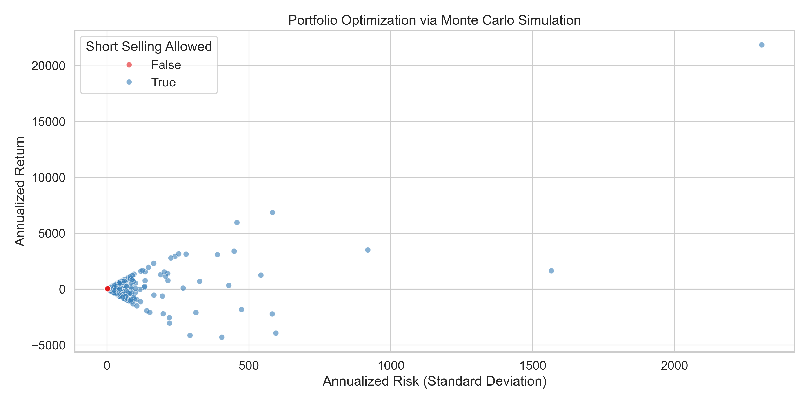

# MSDS-451-Week5-Programming-Assignment2

#  Portfolio Optimization via Monte Carlo Simulation

> MSDS 451 – Programming Assignment 2  
> Northwestern University | Master of Science in Data Science  
---

##  Repository Structure

This repository contains all materials for **Programming Assignment 1** for the course **MSDS 451 – Financial and Risk Analytics Using Monte Carlo**.

| File/Folder                | Description                                                                 |
|---------------------------|-----------------------------------------------------------------------------|
| `451_PA2.ipynb`           | Final Jupyter notebook with full code for simulation and analysis          |
| `monte_carlo_portfolios.csv` | Output CSV file with all simulated portfolio returns, risks, and weights  |
| `portfolio_optimization_monte_carlo.png` | Visualization of risk-return tradeoffs via scatterplot         |
| `451-portfolio-optimization-monte-carlo.pdf` | Research report submission (PDF)                                 |
| `README.md`               | Overview of the project                                                     |

---

##  Problem Statement

This assignment explores how to optimize portfolios using **Monte Carlo simulation** across a set of assets with known expected returns and standard deviations. The goal is to identify asset allocations that maximize return for a given level of risk, and compare scenarios with and without **short selling**.

---

##  Methodology Overview

- **Asset Assumptions**:  
  The simulation considers three hypothetical assets with predefined annual expected returns and volatilities (standard deviations).

- **Monte Carlo Simulation**:  
  A large number of random portfolio weight combinations are sampled. For each:
  - Portfolio return is calculated as a weighted sum of asset returns.
  - Portfolio risk is computed via the variance-covariance matrix.

- **Scenarios**:
  1. **Short Selling Allowed**: Weights can be negative (sum to 1).
  2. **No Short Selling**: Weights are constrained between 0 and 1 (sum to 1).

- **Selection Criterion**:  
  Optimal portfolios are selected based on highest return and lowest risk combinations in each case.

---

##  Results

### Visualization

The following chart was generated from the simulation:

 **Figure:** Portfolio Optimization Results via Monte Carlo Simulation  


- **Blue Dots**: Portfolios with short selling allowed  
- **Red Dot**: Optimal portfolio without short selling  

The scatterplot clearly shows the trade-off between **annualized risk** and **return**, and highlights how allowing short selling significantly expands the feasible frontier.

---

##  Key Insights

- **Short Selling** allows for greater diversification and broader exploration of the efficient frontier, but at the cost of higher volatility.
- **Constraints (no short selling)** lead to more conservative portfolios with reduced risk potential but limit return extremes.
- Monte Carlo provides a flexible way to empirically explore the distribution of risk-return outcomes.

---

##  How to Run

1. Clone the repository:

```bash
git clone https://github.com/Shruti722/MSDS-451-Programming-Assignment-1.git
cd MSDS-451-Programming-Assignment-1
```
2. Open the notebook:
```bash
jupyter notebook 451_PA2.ipynb
```

3. Run all cells to regenerate the results and visualizations.


